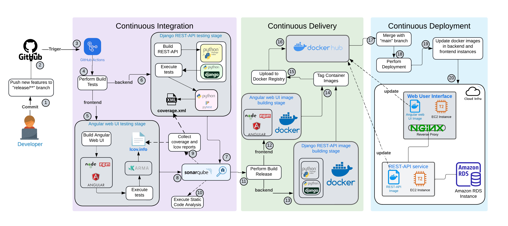

# 🏠 House Billing App

**House Billing App** is a cloud-native platform that enables households to transparently manage shared expenses.  
Admins can create groups, add expenses, and settle balances, while users can track and view their debts in real time.  

The project focuses on **DevSecOps practices**, leveraging **AWS Infrastructure**, **GitHub Actions CI/CD pipelines**, and **SonarQube** for automated security analysis.

---

## 📂 Repositories

- 🌐 [**Angular GUI**](https://github.com/alexandermamaniy/devops-sec-house-billing-app-web-user-interface) — User-facing web interface.  
- ⚙️ [**Django REST-API**](https://github.com/alexandermamaniy/devops-sec-house-billing-rest-service) — Backend and main API service.  
- ☁️ [**AWS Infrastructure**](https://github.com/alexandermamaniy/devops-sec-house-billing-app-deploy) — Infrastructure as Code (Terraform) for AWS deployment.  

📖 [**Full Project Report (PDF)**](https://github.com/alexandermamaniy/house-billing-app/blob/main/document/house_billing_project.pdf)

---

## ⚡ Cloud Architecture

The system uses a **layered architecture**, ensuring separation of concerns and security isolation:  

- **Angular + NGINX** → User interface.  
- **Django REST API** → Business logic and rules.  
- **AWS RDS (PostgreSQL)** → Persistent storage.  
- **NGINX Reverse Proxy** → Routes UI requests to API, protecting backend and database.  

### Network Security
- Private subnets for RDS and REST API.  
- Public subnet only for NGINX and SonarQube.  
- NAT Gateway for controlled outbound internet access.  
- Security Groups enforcing **least-privilege rules**.  

---

## 🛠️ CI/CD Workflow

The CI/CD pipelines are implemented in **GitHub Actions**:

1. **Continuous Integration (CI)**  
   - Triggered on every commit to `release/**`.  
   - Runs **Angular (Karma)** and **Django (Pytest)** tests.  
   - Generates coverage reports (`lcov.info`, `coverage.xml`).  
   - Performs **SonarQube static analysis**.  

2. **Continuous Delivery (CD)**  
   - Builds **Docker images** for Angular and Django services.  
   - Publishes versioned images to **DockerHub**.  

3. **Continuous Deployment (CD)**  
   - Triggered on `main` branch merge.  
   - Connects to AWS instances.  
   - Pulls updated Docker images.  
   - Restarts containers with zero downtime.  

---

## 📊 Static Code Analysis (SonarQube)

- ✅ Django REST API: >80% coverage.
- Reduce code duplication, code smells, and security hotspots

---

## 🛡️ Security Practices

Security is built into every layer of the House Billing App:

- **Infrastructure:** Automated, auditable deployments with Terraform and a multi-AZ setup for high availability. Strict firewall rules minimize exposure.
- **Application:** UI input validation prevents SQL injection. No hard-coded credentials; tests use fake data. NGINX proxy shields the backend.
- **Code:** SonarQube runs in CI/CD to catch security hotspots, code duplication, and code smells early.

---
